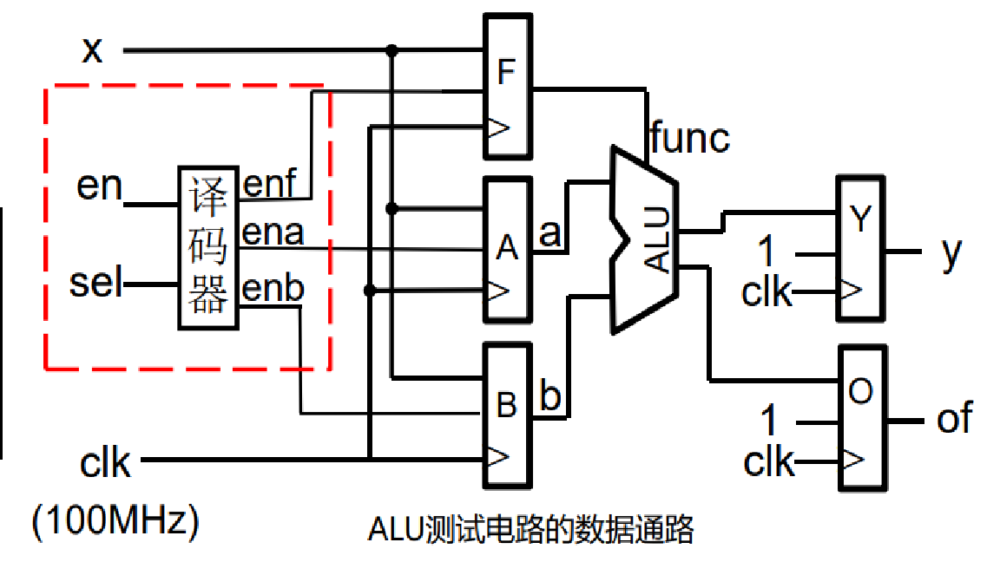
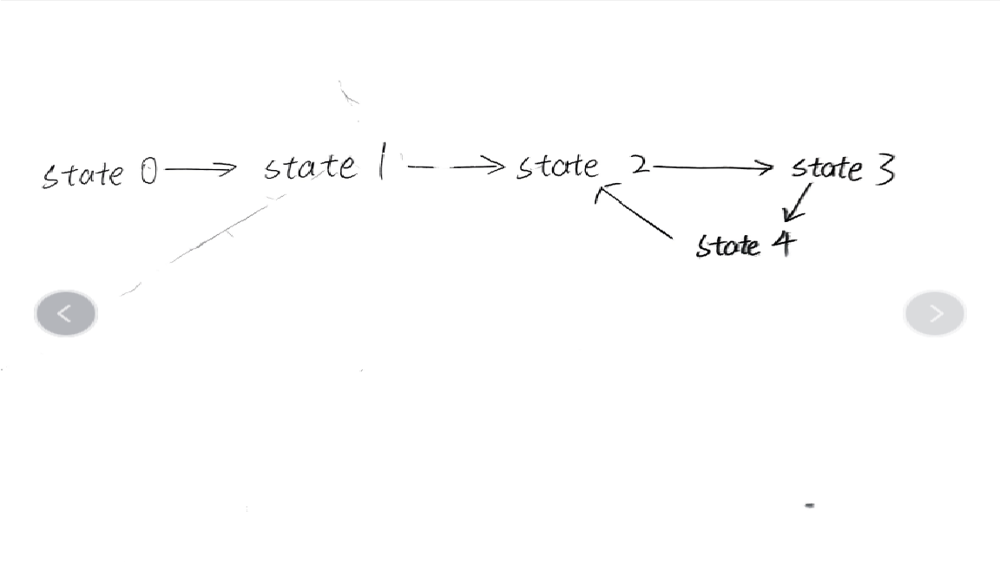
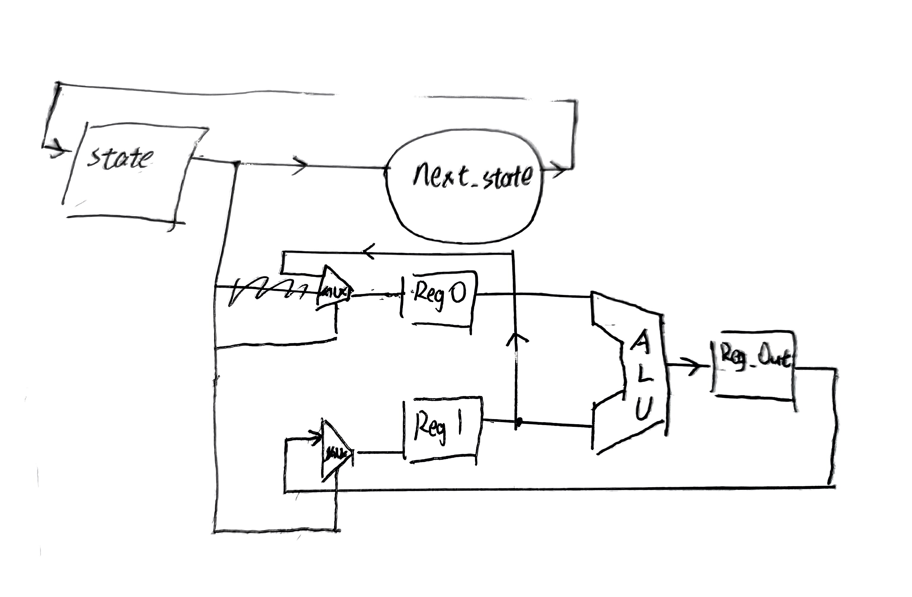
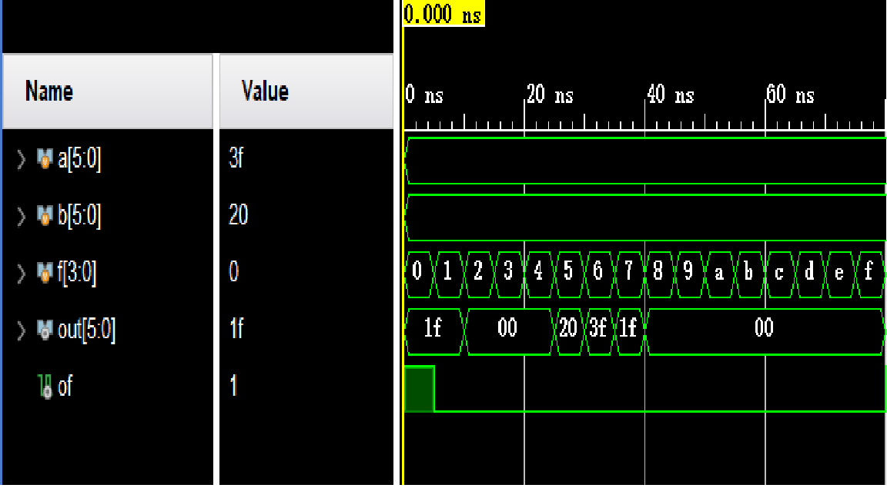
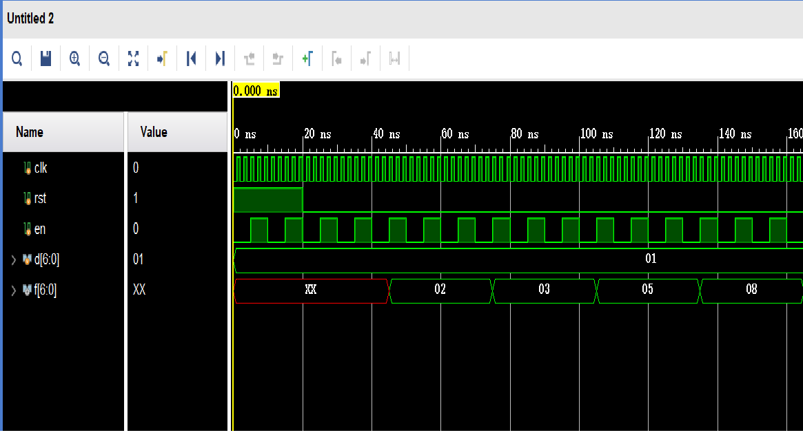
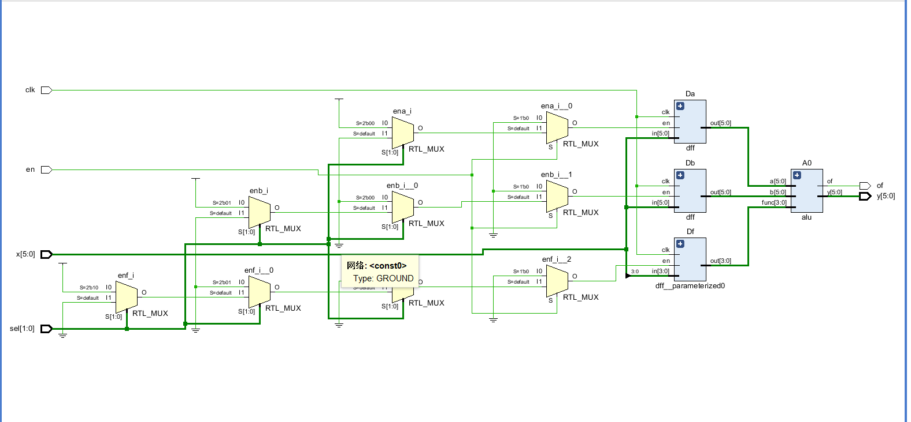
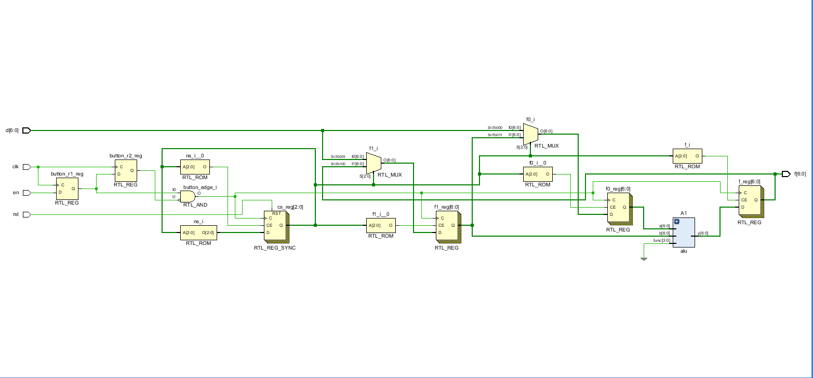
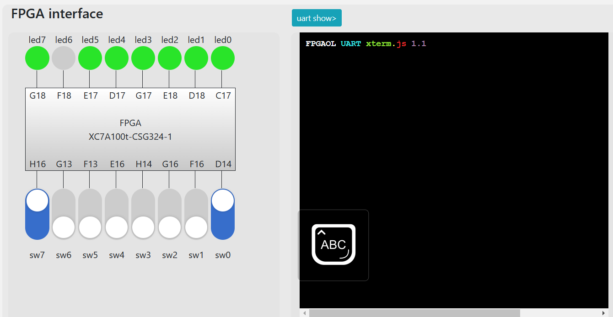
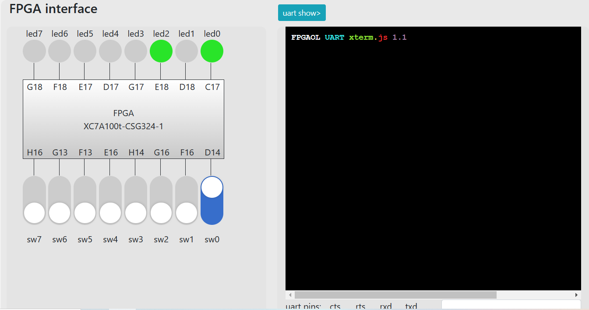

# 1. 实验目的与内容
## 1.1 实验目的
1. 掌握算术逻辑单元(ALU)的功能
2. 掌握有限状态机的设计方法
3. 复习组合电路和时序电路，以及参数化、结构化的Verilog描述方法
## 1.2 实验内容
1. 实现一个ALU
2. 实现适用于FPGAOL的ALU测试电路
3. 用三段式的描述方法实现一个状态机，利用ALU生成斐波那契数列。
# 2. 逻辑设计
## 2.1 ALU
### 核心代码
ALU通过输入func选择相应功能，对输入a和b进行操作生成输出y，在verilog中可以通过```case```块或者```if-else```块实现。加法、左移等都可以通过相应语句实现。此处仅给出判断加法溢出和减法溢出的代码：
```verilog
        if(func == 4'b0000) begin
            y = a + b;
            if(a[WIDTH-1] == 1 && b[WIDTH-1] == 1) of = (y[WIDTH-1] == 1)?0:1;
            else if (a[WIDTH-1] == 0 && b[WIDTH-1] == 0) of = (y[WIDTH-1] == 0)?0:1;
            else of = 0;
        end
        else if(func == 4'b0001) begin
            y = a - b;
            if(a[WIDTH-1] == 0 && b[WIDTH-1] == 1) of = (y[WIDTH-1] == 1)?1:0;
            else if (a[WIDTH-1] == 1 && b[WIDTH-1] == 0) of = (y[WIDTH-1] == 0)?1:0;
            else of = 0;
        end
```
通过输出y的符号位判断。

加法溢出有两种情况：
1. 正数+正数，上溢，y为负数。
2. 负数+负数，下溢，y为正数。


减法溢出有两种情况：
3. 负数－正数，下溢，y为正数。
4. 正数－负数，上溢，y为负数。

通过```if-else```语句，根据y的符号位给of赋值即可。

## 2.2 ALU_test
### 数据通路
使用实验手册中的数据通路。

### 核心代码
译码器可以通过```case```块或者```if-else```块来实现。
```verilog
    always @(*) begin
        if(en == 0) begin
            ena = 0;
            enb = 0;
            enf = 0;
        end
        else if(sel == 2'b00) begin
            ena = 1;
            enb = 0;
            enf = 0;
        end
        else if(sel == 2'b01) begin
            ena = 0;
            enb = 1;
            enf = 0;
        end
        else if(sel == 2'b10) begin
            ena = 0;
            enb = 0;
            enf = 1;
        end
        else begin
            ena = 0;
            enb = 0;
            enf = 0;           
        end
    end
```
## 2.3 FLS
### 状态机

如图，state0和state1分别输入两个寄存器的初始数据，state2更新输出，state3和state4更新两个寄存器。
### 数据通路草图

### 核心代码
采用三段式实现状态机，其中根据状态生成输出的代码如下：
```verilog
    always @(posedge button_edge) begin
        case (cs)
            s0: f0 <= d;
            s1: f1 <= d;
            s2: f <= out;
            s3: f0 <= f1;
            s4: f1 <= f;
            default: f <= out;
        endcase
    end
```

# 3. 仿真结果与分析
## 3.1 ALU

同一组输入在不同func下的输出y和of如图所示。

输入为111111(-1)和100000(-32)，加法溢出，减法不溢出。
## 3.2 FLS

如图，在每个button的边沿状态更新，三次button边沿后输出f将更新。

# 4. 电路设计与分析
## 4.1 ALU_test的RTL电路

## 4.2 FLS的RTL电路

# 5. 测试结果与分析

如图，31-(-32)得到-1的补码，同时led[7]=1,表示溢出。


如图，在输入1,1的情况下可以正确生成斐波那契数列$2,3,5,8,\cdots$
# 6. 总结
1. 本次实验实现了alu和简单应用电路。同时复习了verilog语法中的三段式状态机、testbench编写等语法，并尝试了vivado的RTL分析等功能。
2. 实验中因为不指定数字是二进制而出了很多bug，应注意verilog默认是十进制。
3. 先画数据通路和状态机可以避免很多想当然的bug。
4. RTL分析时可能会优化，导致电路和预想中不同。


