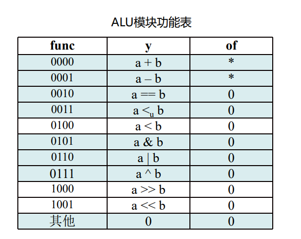

# 实验目的
- 搭建一个单周期CPU，能运行RISC-V的部分指令
- 用此CPU运行测试程序和Lab3中的斐波那契数列计算程序，验证CPU正确性
# 实验原理
## 数据通路
采用手册中的数据通路，如下：

## Control模块
根据指令的Opcode，对各个输出信号赋值，具体规则如下表：
| Opcode  | 例子  | ALUOpc | wb_en | wb_sel  | mem_we | alu_op_1 | alu_op_2 | rf_re0 | rf_re1 |
| ------- | ----- | ------ | ----- | ------- | ------ | -------- | -------- | ------ | ------ |
| 0010011 | addi  | 11     | 1     | 00(alu) | 0      | 0        | 1        | 1      | 0      |
| 0110011 | add   | 10     | 1     | 00      | 0      | 0        | 0        | 1      | 1      |
| 0010111 | auipc | 00     | 1     | 00      | 0      | 1        | 1        | 1      | 0      |
| 1101111 | jal   | 00     | 1     | 01      | 0      | 1        | 1        | 1      | 0      |
| 1100111 | jalr  | 00     | 1     | 01      | 0      | 0        | 1        | 1      | 1      |
| 1100011 | beq   | 00     | 0     | xx      | 0      | 1        | 0        | 1      | 1      |
| 0000011 | lw    | 00     | 1     | 10      | 0      | 0        | 1        | 1      | 1      |
| 0100011 | sw    | 00     | 0     | xx      | 1      | 0        | 1        | 1      | 1      |
| 0110111 | lui   | xx     | 1     | 11      | 0      | xx       | xx       | 1      | 0      | 

表中未列出信号的一些信号如下：
- jal和jalr，在遇到对应指令时输出。
- br_type直接取ins[14:12]，也就是func3字段即可。

alu_ctrl信号的情况较为复杂，因此将指令分为三类，生成对应的ALUOpc，并用一个辅助模块ALU_helper来赋值，规则如下：
| ALUOpc | instruction[30],ins[14:12] | ALU_ctr   |
| ------ | -------------------------- | --------- |
| 00     | xxxx                       | 0000(+)   |
| 10     | 0000                       | 0000(+)   |
| 10     | 1000                       | 0001(-)   |
| 10     | 0001                       | 1001(<<)  |
| 10     | 0100                       | 0111(^)   |
| 10     | 0101                       | 1000(>>)  |
| 10     | 0110                       | 0110(or)  |
| 10     | 0111                       | 0101(and) |
| 11     | x000                       | 0000(+)   |
| 11     | x100                       | 0111(^)   |
| 11     | x110                       | 0110(or)  |
| 11     | x111                       | 0101(and) |
| 11     | x001                       | 1001(<<)  |

00代表beq等只需要加法的指令，10代表R-type型指令，11代表I-type型指令。R-type和I-type的主要区别是R-type需要inst[30]来分辨add和sub等成对的指令，而I-type的inst[30]是立即数字段，不应该参与判断。

具体代码如下：
```verilog
module Control(

    input [31:0] inst,

    output jal,

    output jalr,

    output [2:0] br_type,

    output reg wb_en,

    output reg [1:0] wb_sel,

    output reg alu_op_1,

    output reg alu_op_2,

    output [3:0] alu_ctrl,

    output reg mem_we,

    output reg [1:0] ALUOpc

    );

    always @(*) begin

        case (inst[6:0])

            7'b0010011://addi

                {ALUOpc, wb_en, wb_sel, mem_we, alu_op_1, alu_op_2} = 8'b11_1_00_0_0_1;

            7'b0110011://add

                {ALUOpc, wb_en, wb_sel, mem_we, alu_op_1, alu_op_2} = 8'b10_1_00_0_0_0;

            7'b0010111://auipc

                {ALUOpc, wb_en, wb_sel, mem_we, alu_op_1, alu_op_2} = 8'b00_1_00_0_1_1;

            7'b1101111://jal

                {ALUOpc, wb_en, wb_sel, mem_we, alu_op_1, alu_op_2} = 8'b00_1_01_0_1_1;

            7'b1100111://jalr

                {ALUOpc, wb_en, wb_sel, mem_we, alu_op_1, alu_op_2} = 8'b00_1_01_0_0_1;

            7'b1100011://beq

                {ALUOpc, wb_en, wb_sel, mem_we, alu_op_1, alu_op_2} = 8'b00_0_00_0_1_1;

            7'b0000011://lw

                {ALUOpc, wb_en, wb_sel, mem_we, alu_op_1, alu_op_2} = 8'b00_1_10_0_0_1;

            7'b0100011://sw

                {ALUOpc, wb_en, wb_sel, mem_we, alu_op_1, alu_op_2} = 8'b00_0_00_1_0_1;

            7'b0110111://lui

                {ALUOpc, wb_en, wb_sel, mem_we, alu_op_1, alu_op_2} = 8'b00_1_11_0_0_0;

            default:

                {ALUOpc, wb_en, wb_sel, mem_we, alu_op_1, alu_op_2} = 8'b0;

        endcase

    end

  

    //todo

    assign jal = (inst[6:0] == 7'b1101111)?1:0;

    assign jalr = (inst[6:0] == 7'b1100111)?1:0;

  

    assign br_type = (inst[6:0] == 7'b1100011)?inst[14:12]:3'b111;

  

    ALU_helper helper(

        .ALUOp(ALUOpc),

        .inst({inst[30],inst[14:12]}),

        .ALU_sel(alu_ctrl)

    );

endmodule
```

```verilog
module ALU_helper(

input[1:0] ALUOp,

input[3:0] inst,

output reg[3:0] ALU_sel);

always@(*)

begin

 case(ALUOp)

 2'b00:ALU_sel=4'b0000;

 2'b01:ALU_sel=4'b0001;

 2'b10:

 begin

 case(inst)

 4'b0000:ALU_sel=4'b0000;

 4'b1000:ALU_sel=4'b0001;

 4'b0001:ALU_sel=4'b1001;

 4'b0100:ALU_sel=4'b0111;

 4'b0101:ALU_sel=4'b1000;

 4'b0110:ALU_sel=4'b0110;

 4'b0111:ALU_sel=4'b0101;

 default:ALU_sel=4'b0001;

 endcase

 end

 2'b11:

 begin

 casex(inst)

 4'bx000:ALU_sel=4'b0000;

 4'bx100:ALU_sel=4'b0111;

 4'bx110:ALU_sel=4'b0110;

 4'bx111:ALU_sel=4'b0101;

 4'bx001:ALU_sel=4'b1001;

 default:ALU_sel=4'b0000;

 endcase

 end

 default:ALU_sel=4'b0001;

 endcase

end

endmodule
```

## ALU模块
采用Lab1中设计的ALU，操作码如下：

## Imm模块
直接采用指令的Opcode分类，给Immediate赋对应值，代码如下：
```verilog
module Immediate(

input[31:0] instruction,

output reg[31:0] Imm

);

always@(*)

begin

 case(instruction[6:0])

 7'b0010011: //addi .etc

    Imm={{20{instruction[31]}},instruction[31:20]};

 7'b1100111://jalr

    Imm={{20{instruction[31]}},instruction[31:20]};

 7'b1101111://jal

    Imm={{12{instruction[31]}}, instruction[19:12], instruction[20], instruction[30:21], 1'b0};

 7'b1100011://beq .etc

    Imm={{20{instruction[31]}}, instruction[7], instruction[30:25], instruction[11:8], 1'b0};

 7'b0000011://lw

    Imm={{20{instruction[31]}},instruction[31:20]}; //lw

 7'b0100011://sw

    Imm={{21{instruction[31]}}, instruction[30:25], instruction[11:7]}; //sw

 7'b0010111://auipc

    Imm={instruction[31:12],12'b0};

 7'b0110111://lui

    Imm={instruction[31:12],12'b0};

 default:Imm=32'b0;

 endcase

end

endmodule
```
jal和beq等指令计算PC地址，需要在最低位补0，以便和2对齐。不直接和4对齐是为了兼容16位系统。

## Branch模块
需要根据指令的fun3字段判断Branch条件，并生成br信号，代码如下：
```verilog
module Branch(

    input [2:0] br_type,

    input [31:0] rd0,

    input [31:0] rd1,

    output reg br

    );

    always @(*) begin

        case (br_type)

            3'b000://beq

                br = (rd0 == rd1)?1:0;

            3'b001://bne

                br = (rd0 == rd1)?0:1;

            3'b100://blt

                br = ($signed(rd0) < $signed(rd1))?1:0;

            3'b101://bge

                br = ($signed(rd0) >= $signed(rd1))?1:0;

            3'b110://bltu

                br = (rd0 < rd1)?1:0;

            default: br = 0;

        endcase

  

    end

endmodule
```
## 寄存器堆
需要保持x0恒为0，且需要初始化，具体代码如下：
```verilog
module RF 

#(parameter WIDTH = 32) 

(   input clk, 

    input[4 : 0] ra0, 

    output[WIDTH - 1 : 0] rd0, 

    input[4: 0] ra1, 

    output[WIDTH - 1 : 0] rd1,

    input[4 : 0] ra_dbg,

    output[WIDTH - 1 : 0] rd_dbg, 

    input[4 : 0] wa, 

    input we, 

    input[WIDTH - 1 : 0] wd 

);

reg [WIDTH - 1 : 0] regfile[0 : 31];

 integer i;

 initial begin

 i = 0;

 while (i < 32) begin

    regfile[i] = 32'b0;

    i = i + 1;

 end

 regfile [2] = 32'h2ffc;

 regfile [3] = 32'h1800;

 end

assign rd0 = regfile[ra0], rd1 = regfile[ra1], rd_dbg = regfile[ra_dbg];

always @ (posedge clk) begin

    if (we && wa != 0) regfile[wa] <= wd;

    else if(!we) regfile[wa] <= regfile[wa];

    else regfile[wa] <= 0;

end

  

endmodule
```
## MEM模块
例化ROM和DPRAM分别作为指令存储器和数据存储器，具体代码如下：
```verilog
module MEM(

    input clk,
    // MEM Data BUS with CPU

    // IM port

    input [31:0] im_addr,

    output [31:0] im_dout,

    // DM port

    input  [31:0] dm_addr,

    input dm_we,

    input  [31:0] dm_din,

    output [31:0] dm_dout,

  

    // MEM Debug BUS

    input [31:0] mem_check_addr,

    output [31:0] mem_check_data

);

   // TODO: Your IP here.

   // Remember that we need [9:2]?

    dist_mem_gen_0 inst_mem(

        .a(im_addr[9:2]),

        .spo(im_dout)

    );

  

    dist_mem_gen_1 data_mem(

        .a(dm_addr[9:2]),

        .d(dm_din),

        .dpra(mem_check_addr[7:0]),

        .we(dm_we),

        .clk(clk),

        .spo(dm_dout),

        .dpo(mem_check_data)

    );

endmodule
```
因为此次设计的MEM是按字寻址的，所以读取地址取第[9:2]位，相当于左移两位。但为了调试方便，mem_check_addr仍然取第[7:0]位。

# 与教材的差异
与教材中图4-21的数据通路相比，有以下区别：
1. jal、beq等指令中，PC目标地址用ALU计算，而不是单独的ADD模块
2. jalr指令中，添加了一个AND模块确保最低位是0
3. 写回数据有四个来源，分别用于R-type、J-type、load、lui等。
4. Branch是否跳转用单独的模块判断，而不是用ALU
# 遇到的问题
- MEM读取地址取第[9:2]位，但为了调试方便，mem_check_addr仍然取第[7:0]位。实验检查时我没有意识到这一点，导致add指令输入4次才能显示下一个数据。
- CPU连线时，要注意赋值对象间关系，避免把输出赋值给输入，产生多驱动。
# 实验结果
给定的测试文件运行结果如下：


选做实现了9条指令，包括sll, slli, srl, sub, xor, and, bne, bge, bltu.
测试文件如下：
```asm
.text

    addi    gp, x0, 0

TEST1:  # sll test  

    addi    gp, gp, 1

    addi    x5, x0, 2       # x5 = 2

    sll     x6, x5, x5      # x6 = 8

    addi    x7, x0, 8       # x7 = 8

    beq     x6, x7, TEST2

    beq     x0, x0, FAIL

  

FAIL:  

    lui x7 7

    addi x7 x7 0x700

    addi x7 x7 0x700

    addi x7 x7 0x100    # x7 = 7f00

    addi x8 x0 1

    sw x8 16(x7)        # led[1] = 0

    beq x0, x0, FAIL    # 失败时会在此处死循环

  

TEST2: # slli test

    addi    gp, gp, 1

    addi    x5, x0, 2       # x5 = 2

    slli    x6, x5, 2       # x6 = 8

    addi    x7, x0, 8       # x7 = 8

    beq     x6, x7, TEST3

    beq     x0, x0, FAIL

  

TEST3: # srl test

    addi    gp, gp, 1

    addi    x5, x0, 8       # x5 = 8

    addi    x6, x0, 1       # x6 = 1

    srl     x6, x5, x6      # x6 = 4

    addi    x7, x0, 4       # x7 = 4

    beq     x6, x7, TEST4

    beq     x0, x0, FAIL

  

TEST4: # sub test

    addi    gp, gp, 1

    addi    x5, x0, 16      # x5 = 16

    addi    x7, x0, 8       # x7 = 8

    sub     x6, x5, x7      # x6 = 8

    addi    x7, x0, 8       # x7 = 8

    beq     x6, x7, TEST5

    beq     x0, x0, FAIL

  

TEST5: # xor test

    addi    gp, gp, 1

    addi    x5, x0, 15      # x5 = 15

    addi    x7, x0, 7       # x7 = 7

    xor     x6, x5, x7      # x6 = 8

    addi    x7, x0, 8       # x7 = 8

    beq     x6, x7, TEST6

    beq     x0, x0, FAIL  

  

TEST6: # and test

    addi    gp, gp, 1

    addi    x5, x0, 15      # x5 = 15

    addi    x7, x0, 7       # x7 = 7

    and     x6, x5, x7      # x6 = 7

    addi    x7, x0, 7       # x7 = 7

    beq     x6, x7, TEST7

    beq     x0, x0, FAIL

  

TEST7: # bne test

    addi    gp, gp, 1

    addi    x5, x0, 1       # x5 = 1

    addi    x6, x0, 2       # x6 = 2

    bne     x6, x5, TEST8

    beq     x0, x0, FAIL

  

TEST8: # bge test

    addi    gp, gp, 1

    addi    x5, x0, 1       # x5 = 1

    addi    x6, x0, 2       # x6 = 2

    bge     x6, x5, TEST9

    beq     x0, x0, FAIL

  

TEST9: # bltu test

    addi    gp, gp, 1

    addi    x5, x5, 1       # x5 = 1

    addi    x6, x5, -2      # x6 = -1

    bltu    x6, x5, WIN

    beq     x0, x0, FAIL

  

WIN:

    lui x7 7

    addi x7 x7 0x700

    addi x7 x7 0x700

    addi x7 x7 0x100    # x7 = 7f00

    addi x8 x0 1

    sw x8 12(x7)        # led[0] = 0

    beq x0, x0, WIN
```
运行结果如下：


斐波那契数列的运行结果如下：
